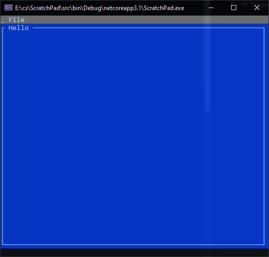
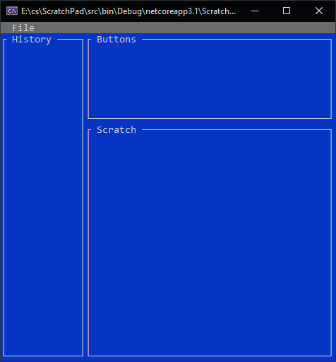

## [100 Projects of Code](https://github.com/RobertCurry0216/100ProjectsOfCode) : Text Editor

---

## What am I doing?

When I'm writing code I usually have note pad open as just a place to copy paste little notes to myself, code snippets, and whatever else. I thought this would be a fun project to sharpen my c# skills and try it implement some other ideas that I've been having a hard time wrapping my head around, namely: Dependency injection

Why make it a console app? Because I always wanted to be a hacker from a 90's movie and it's cool as heck.

---

## First things first

Lets get our feet wet with the Terminal.Gui

After browsing the docs and playing around with the sample code I got this:



Nice and easy :)

Now to think about how I actually want this to work. After a bit of toying around I got to this:



```
static void Main(string[] args)
        {
            Application.Init();

            // I've just added dummy buttons in for now
            // Quit is the only one that does anything
            var menu = new MenuBar(new MenuBarItem[] {
                new MenuBarItem ("_File", new MenuItem [] {
                    new MenuItem ("_New", "", () => { }),
                    new MenuItem ("_Save", "", () => { }),
                    new MenuItem ("_Load", "", () => { }),
                    new MenuItem ("_Quit", "", () => {Application.RequestStop ();})
                }),
            });


            // I want to have a running history of snips added
            // and be able to scroll through them
            var historyWindow = new Window("History")
            {
                X = 0,
                Y = 1,
                Width = 15,
                Height = Dim.Fill()
            };

            // This is where I'll have the copy / paste buttons
            var buttonsWindow = new Window("Buttons")
            {
                X = 15,
                Y = 1,
                Width = Dim.Fill(),
                Height = 8
            };

            // Teh actual text window
            var scratchWindow = new Window("Scratch")
            {
                X = 15,
                Y = 9,
                Width = Dim.Fill(),
                Height = Dim.Fill()
            };

            // There was a bug where shrinking the window would cover the 
            // history panel, this was the only thing I could figure to fix it
            Application.Resized = (Application.ResizedEventArgs args) =>
            {
                historyWindow.Width = 15;
                buttonsWindow.X = 15;
                scratchWindow.X = 15;
            };

            // Add both menu and win in a single call
            Application.Top.Add(menu, historyWindow, buttonsWindow, scratchWindow);
            Application.Run();
        }

```

As you can see, theres 3 basic areas
 - History: as running history of saved snips you can scroll through
 - Buttons: Copy and Paste buttons
 - Scratch: where the text will be saved.

I had some issues getting this layout working, resizing the window would cover the history so I added the Application.Resized function to fix it. Might not be the best fix but I'll come back to that.

---

Thats where I'm going to leave it for today, next time I'll be adding some actual functionality!

