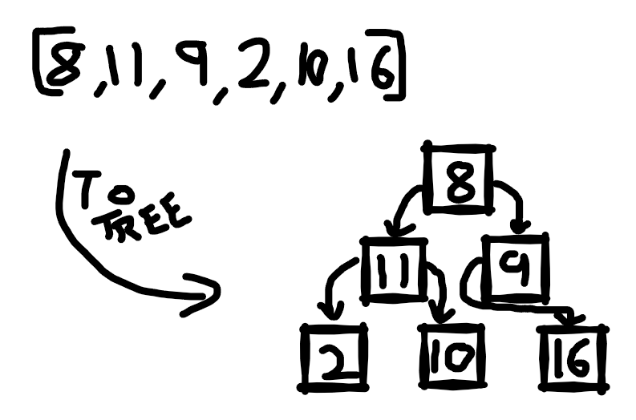
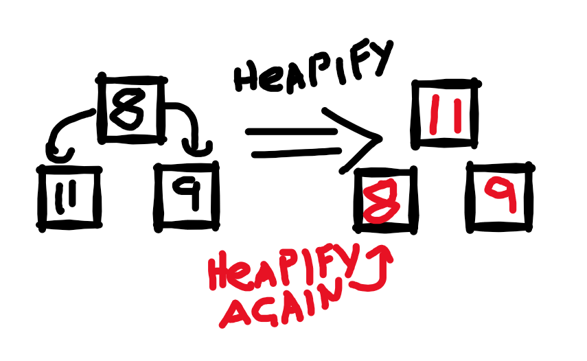

Continuing on with my exploration of basic computing algorthms. Today we have Heap Sort.

---

## What is Heap Sort?

heap sort uses a binary tree structure to greatly reduce the number of comparison. The best, worst, and average case runtime is O(nLog(n)), which is pretty good.

This one caused me quite a bit of confusion because I misunderstood the tree structure. I've previously built a binary search tree (not on this blog but I'll probably get to it at some point) and the way that structure works for each node of the tree, the left value is lower than the head, and the right value is higher. 

That's not how this tree works (╯°□°）╯︵ ┻━┻)

For this tree, the head is bigger than each leaf and each layer of the tree is filled from left to right.


---

## Implimenting It!

The first thing to do is impliment the tree structure, and this is something I found very clever. It's actuall just an array where: 

```csharp
node = idx;
left = (idx * 2) + 1
right = (idx * 2) + 2
```

No need to create a Node class or anything, clever.



### Bit 1 - Heapify

The heapify function is the core of the heap sort function, and it is deceptively simple (for me at least, I got stuck for a while wondering what it actually did).

For a given node, it find which is the highest value from the head, left leaf, and the right leaf. Then swaps the highest value to the head position.

If it made a swap, it calls it's self on the leaf it swapped from.



The `max` parameter is an important thing to note while writing this function. It's very important when doing the actual sort (otherwise we could just use the list.Count)

Here it is in code:

```csharp

// Makes sure the head of the node is the largest value
// and recursively call itself if the head wasn't already the biggest value
private static void heapify(List<int> lst, int idx, int max)
{
    var largest = idx;
    var left = (idx * 2) + 1;
    var right = (idx * 2) + 2;

    // find the highest value out of
    // idx, left, and right
    if (left < max && lst[left] > lst[largest])
    {
        largest = left;
    }
    if (right < max && lst[right] > lst[largest])
    {
        largest = right;
    }

    // move largest value to the head of the node
    if (largest != idx)
    {
        var tmp = lst[idx];
        lst[idx] = lst[largest];
        lst[largest] = tmp;

        // recursively call heapify back down the tree
        heapify(lst, largest, max);
    }
}

```

### Bit 2 - BuildHeap

This function takes the initial arr and changes it into the tree format. During the sort it's run once at the start.

Implimenting this is simple enough:

- Start from index (n/2) - 1, when n is the length of the initial list.
- Call Heapify on that element
- reduce the index by and repeat
- continue till index 0

Implimenting this is easy enough, a simple for loop does the trick:

```csharp
// Builds the initial heap
// starts from the second bottom row of the tree
// and works it's way up to make sure the 
// highst value is at the top of the tree
private static void BuildHeap(List<int> lst)
{
    var n = lst.Count;
    for (int i = (lst.Count / 2) - 1; i >= 0; i--)
    {
        heapify(lst, i, n);
    }
}
```

### Bit 3 - Sort

After the initial tree has been built we can do the actual sort now.

Sorting will take n iterations and will have 2 steps:

1. Swap the first and last element
2. Heapify the first element, setting the max to n-1

This part took me a while to wrap my head around too. This is where the max parameter comes into play, after each swap the max is reduced by one, effectivly locking in the last element, and the rest of the list is re-heapifyed.

Implmenting this is just another for loop, nice and easy.

```csharp
public static IEnumerable<int> Sort(IEnumerable<int> values)
{
    var lst = values.ToList();

    BuildHeap(lst);

    for (int i = lst.Count - 1; i > 0; i--)
    {
        //swap first and last elements
        var tmp = lst[0];
        lst[0] = lst[i];
        lst[i] = tmp;

        //run heapify on the reduced list
        heapify(lst, 0, i);
    }

    return lst;
}

```

And thats Heap Sort!

---

## Hows it run?

So average/best/worst case is O(nLog(n)) but in real numbers compairing it to Insertion Sort with a list of 100000 random numbers I get:

- Heap sort: 614ms
- Insertion Sort: 16.7 sec

Thats a huge increase!

---

That it for me today, I had fun learning heap sort and learnt some nice tricks ＜（＾－＾）＞

---

# [View the code on Github](https://github.com/RobertCurry0216/NutshellAlgorithms)
