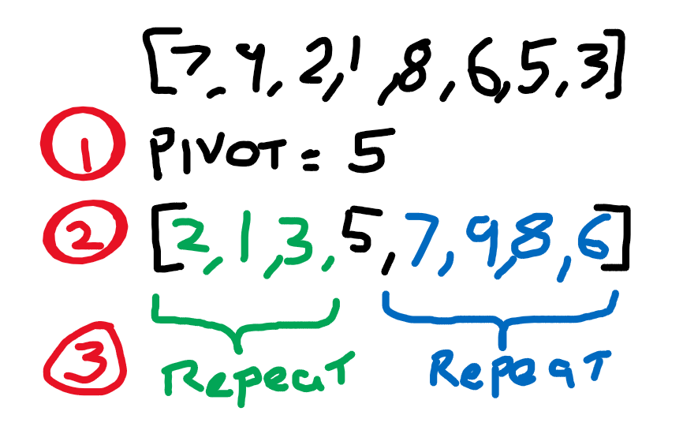

More algorithms! more sorting! today we have QuickSort, lets see if it lives up to it's name.

---

## What is?

QuickSort uses a divide and conquer stratagy to sort elements. The process looks something like this:

1. Choose a pivot value
2. Move all the values lower than the pivot to the left of the pivot and all the values higher to the right.
3. Repeat for the low values, and the high values. This repeated all the way down untill each side of the pivot has 1 or fewer elements.



---

## Implimenting it

### Bit 1

The main function for QuickSort is the Partition function which shifts the elements arount the pivot. But before we do that we need to choose a pivot! Idealy the median vaule would be used but finding the median value before the elements are sorted is kinda impossible. There are some other options, you could use the median of 3 randomly selected values. However, in practice using a random value is fine, so thats what I'm doing.

Here's the code for my Partition function:

```csharp
private static int Partition(List<int> values, int low, int high)
{
    var pivot = low;
    var pivotValue = values[high];
    int tmp;

    for (int i = low; i < high; i++)
    {
        if (values[i] < pivotValue)
        {
            // swap values at i and pivot
            tmp = values[i];
            values[i] = values[pivot];
            values[pivot] = tmp;

            // inc pivot
            pivot++;
        }
    }

    // move pivot value to the pivot index
    tmp = values[pivot];
    values[pivot] = values[high];
    values[high] = tmp;

    return pivot;
}

```

As you can see, it takes in a list of elements and also a sub range to be partitioned (`low`, `high`). Why we do this will become clear in the next bit.

The `pivotValue` is simply set to the last value, this is as good as random. Like I said before, there are better ways to do this but random is good enough.


`pivot` is set to `low` as nothing has been moved to the left of it yet.

After the initial set up the process is easy enough:

Iterate up the list, if you find a value lower than `pivotValue` swap it with `pivot` and increase `pivot` by one.

Finally swap `pivotValue` into it's correct position.

### Bit 2

The second function of QuickSort is a recursive function that call `Partition` and then calls itself on the left and right sides.

```csharp
private static void DoQuickSort(List<int> values, int low, int high)
{
    // recursion exit clause
    if (low > high) return;

    // partition values
    int pi = Partition(values, low, high);

    // quicksort each side of the partition
    DoQuickSort(values, low, pi - 1);
    DoQuickSort(values, pi + 1, high);
}
```

### Bit 3

I wrapped the `DoQuickSort` function just to make it a bit easier to use.

```csharp
public static IEnumerable<int> Sort(IEnumerable<int> values)
{
    var lst = values.ToList();
    DoQuickSort(lst, 0, lst.Count-1);
    return lst;
}
```

That's QuickSort!

## How's it run?

It seems to live up to it's name beating both InsertionSort and HeapSort of a list of 100000 random numbers

- Heap: 86ms
- Insertion: 16.7sec
- Quick: 64ms

It does mave a pretty poor worst case though of O(n^2), best and average can of O(nLog(n)) which is as good as you can hope for in sorting algorithms.

## More

There are more optimisations I could make, choosing the pivot better would help avoid worst case scenarios.

QuickSort actually proforms poorly on short lists so a common optimisation is to InsertionSort once the partitions are small enough. I decided to leave this out though as this is just for practice and I wanted to see the quick sort in action.

---

# [View the code on Github](https://github.com/RobertCurry0216/NutshellAlgorithms)
