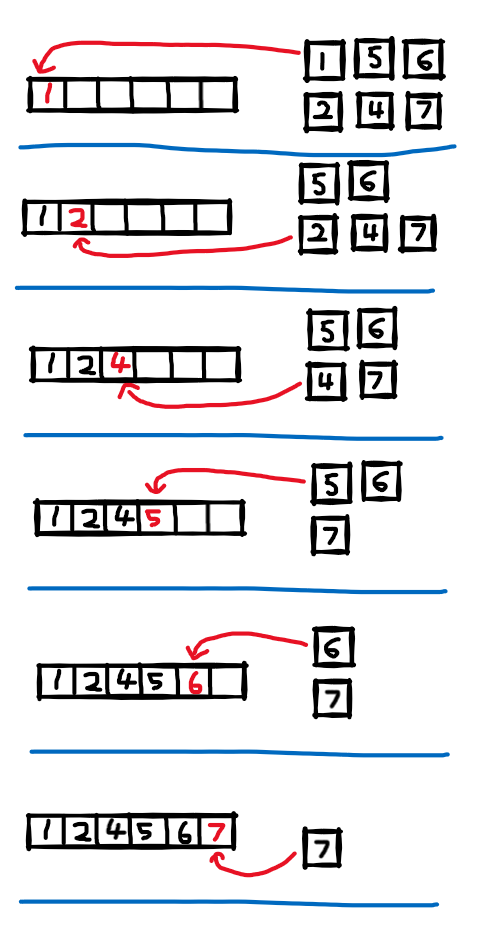

The final sorting algorithm in the book! I've actually done this one before so it was pretty easy for me to impliment so this will probably be a pretty short post.

---

## What is?

The idea of merge sort is that if you have two shorter lists that have already been sorted it's quite simple to join them into one big sorted list. Simply compair the first element of each smaller list, take smaller value into the big list. Repeat till one list is empty and then add the remaining values onto the end.



But, I can hear you asking, 'how do we sort the smaller lists?' Well we Merge sort them of course!

But then we still have to sort the two even smaller lists and this is where the second principal of Merge sort comes in. 

A list with only 1 element is guarenteed to be sorted.

So we keep going down the call stack, splitting the lists until they only have one element, then back up merging the sorted lists as we go.

---

## Implimenting it

This one isn't that complicated once you under stand the idea so I'm just going to post the code up. Reading through it should make enough sense.

```csharp
public static class Merge
{
    public static IEnumerable<int> Sort (IEnumerable<int> values)
    {
        var copy = values.ToList();
        var sorted = values.ToList();
        MergeSort(ref copy, ref sorted, 0, sorted.Count());

        return sorted;
    }

    private static void MergeSort(ref List<int> arr, ref List<int> result, int start, int end)
    {
        // recursion escape cases
        if (end - start < 2) return;
        if (end - start == 2 && result[start] > result[start + 1])
        {
            var tmp = result[start];
            result[start] = result[start + 1];
            result[start + 1] = tmp;
            return;
        }

        //split array in half and sort
        var mid = (end + start) / 2;
        MergeSort(ref result, ref arr, start, mid);
        MergeSort(ref result, ref arr, mid, end);

        // Combine sorted lists
        var i = start;
        var j = mid;
        var idx = start;
        while (idx < end)
        {
            if (j >= end || (i < mid && arr[i] < arr[j]))
            {
                result[idx] = arr[i];
                i++;
            }
            else
            {
                result[idx] = arr[j];
                j++;
            }
            idx++;
        }
    }
}

```

# [View the code on Github](https://github.com/RobertCurry0216/NutshellAlgorithms)